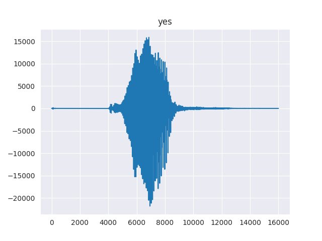
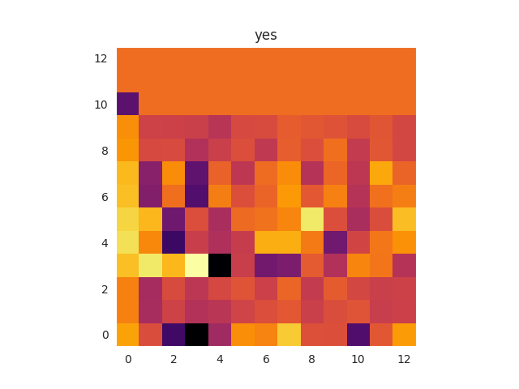
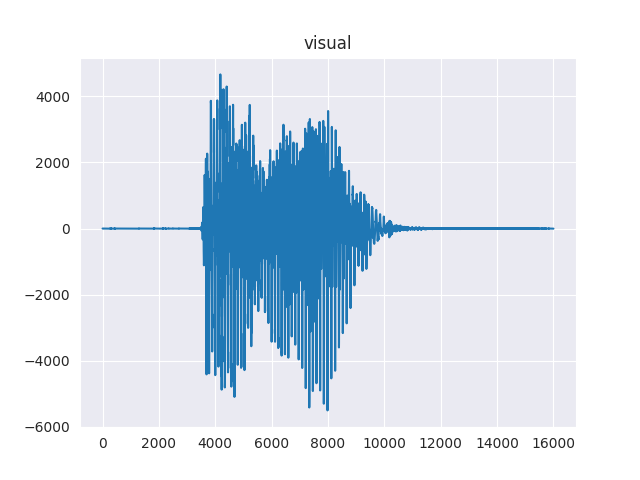
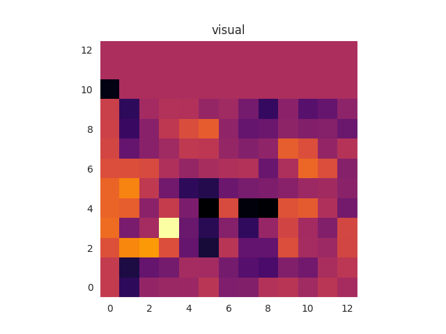
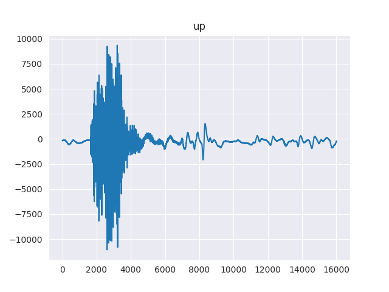
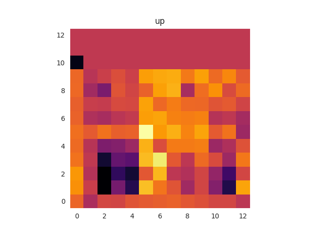

# Speech Recognition with TensorFlow

In this project a Convolutional Neural Network is implemented using TensorFlow in order to perform speech recognition. Additionally, inference will be run on the trained model using TensorFlow Lite to obtain a smaller model that is suitable for being deployed on edge devices. More specifically for this project, the lite model will be deployed on a Raspberry Pi 3B+ which will be configured to listen for spoken words and then display the predicted word in real time.

## Overview
- [Speech Recognition with TensorFlow](#speech-recognition-with-tensorflow)
  - [Overview](#overview)
  - [Getting Started](#getting-started)
    - [Installation](#installation)
    - [Usage](#usage)
  - [Dataset](#dataset)
  - [Preprocessing](#preprocessing)
  - [Model Architecture](#model-architecture)
  - [Training](#training)
  - [Deploy Model on Raspberry Pi](#deploy-model-on-raspberry-pi)


## Getting Started

### Installation

```
python3 -m venv env
source env/bin/activate
pip install -r requirements.txt
```

### Usage

In order to download the dataset and perform the feature extraction simply run
```
python src/feature_extraction.py
```

In order to train the model, run the command
```
python src/train.py
```

Convert the trained model into the lite version
```
python src/model-converter.py -i results/model -o results/lite_model.h5 
```

## Dataset

The dataset used is the Speech Commands from [TensorFlow Datasets](https://www.tensorflow.org/datasets/catalog/speech_commands), containing a total of 100103 recordings of spoken words.

## Preprocessing

The preprocessing consists of extracting features ([MFCC](https://en.wikipedia.org/wiki/Mel-frequency_cepstrum)) from each audio sample (.wav-file). Since each audio sample is only approximately 1 second long, the size of the generated MFCCs will vary slightly. In order to train the model the input size of each sample needs to be fixed, which is done using zero-padding when necessary.

Below are some visual representations of the features extracted for some of the spoken words, which the CNN will learn from.

Audio Recording              |         MFCC
:---------------------------:|:-------------------------:
     | 
  | 
      | 


## Model Architecture


Layer (type)                    |          Output Shape     |    Num. Param   
:------------------------------:|:-------------------------:|:----------------:
input (InputLayer)              |    (None, 16, 16, 1)      |  0     
conv2d (Conv2D)                 |    (None, 16, 16, 1)      |  416         
conv2d_1 (Conv2D)               |    (None, 16, 16, 16)     |  6416           
max_pooling2d (MaxPooling2D)    |    (None, 8, 8, 16)       |  0           
conv2d_2 (Conv2D)               |    (None, 8, 8, 32)       |  4640           
conv2d_3 (Conv2D)               |    (None, 8, 8, 32)       |  9248           
max_pooling2d_1 (MaxPooling2D)  |    (None, 4, 4, 32)       |  0
conv2d_4 (Conv2D)               |    (None, 4, 4, 64)       |  8256           
conv2d_5 (Conv2D)               |    (None, 4, 4, 64)       |  36928   
max_pooling2d_2 (MaxPooling2D)  |    (None, 2, 2, 64)       |  0         
flatten (Flatten)               |    (None, 256)            |  0         
dense (Dense)                   |    (None, 256)            |  65792     
dropout (Dropout)               |    (None, 256)            |  0         
dense_1 (Dense)                 |    (None, 128)            |  32896
output (softmax)                |    (None, 35)             |  4515      
```
Total params: 169,107
Trainable params: 169,107
Non-trainable params: 0
```
## Training

The network was trained for 30 epochs using `dropout=0.2` and `batch_size=100`, with an initial learning rate of 1e-3.


## Deploy Model on Raspberry Pi
TODO