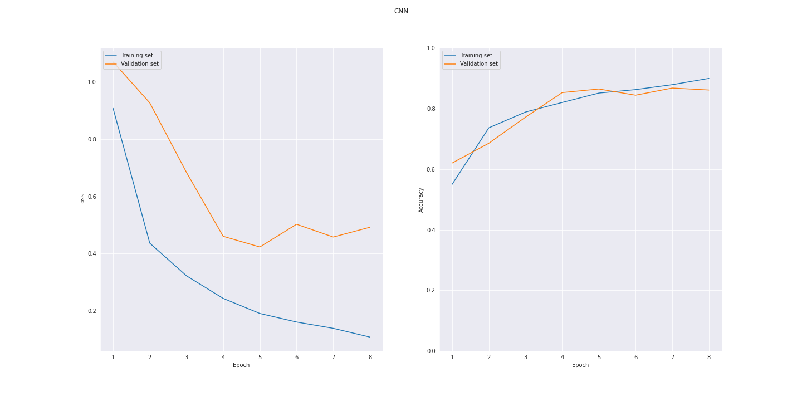

# Speech Recognition with TensorFlow

In this project a Convolutional Neural Network is implemented using TensorFlow in order to perform speech recognition. Additionally, inference will be run on the trained model using TensorFlow Lite to obtain a smaller model that is suitable for being deployed on edge devices. More specifically for this project, the lite model will be deployed on a Raspberry Pi 3B+ which will be configured to listen for spoken words and then display the predicted word in real time.

## Overview

- [Speech Recognition with TensorFlow](#speech-recognition-with-tensorflow)
  - [Overview](#overview)
  - [Getting Started](#getting-started)
    - [Installation](#installation)
    - [Usage](#usage)
  - [Dataset](#dataset)
  - [Pipeline](#pipeline)
    - [Preprocessing](#preprocessing)
    - [Data Augmentation](#data-augmentation)
    - [Feature Extraction](#feature-extraction)
  - [Training](#training)
  - [Deploy Model on Raspberry Pi](#deploy-model-on-raspberry-pi)

## Getting Started

### Installation

```
python3 -m venv env
source env/bin/activate
pip install -r requirements.txt
```

### Usage

Start the notebook `train.ipynb` which will download the dataset, set up the pipeline for preprocessing and train the model.

```
notebook jupyter
```

The trained model which is saved to `results/model.h5` can then be converted into the TFLite version

```
python src/model_converter.py -i results/model.h5 -o results/model
```

## Dataset

The dataset used is the Speech Commands from [TensorFlow Datasets](https://www.tensorflow.org/datasets/catalog/speech_commands), containing a total of more than 100k recordings of 35 spoken words. The trained network will be trained to identify 12 categories, 10 of which are words and the remaining two is whether the sound is either `unknown` or `silence`. Specifically, the labels are

```
'unknown', 'silence', 'yes', 'no', 'up', 'down', 'left', 'right', 'on', 'off', 'stop', 'go'
```

## Pipeline

A pipeline for preprocessing and data augmentation is set up in order to train the network.

### Preprocessing

The preprocessing consists of decoding audio samples (.wav-file) such that the amplitudes are `[-1.0, 1.0]`.
Since each audio sample is only approximately 1 second long, the sizes will vary slightly. Each sample is therefore zero-padded to insure that the inputs always have equal shape.

### Data Augmentation

Training samples will randomly be augmented by adding noise to the source signal. The noise added consists of random segments from one of the longer recordings from `/_background_noise_`.

### Feature Extraction

The features that the network will train on are the log melspectograms calculated from the signals.

The actual feature extraction is implemented in such a way that it's not part of the data pipeline per se. Instead a custom layer is added as the first layer of the network where the features are computed. This means that the feature extraction is done by the GPU instead of the CPU during the preprocessing stage, which results in a considerable reduction in total training time.

Below are some visual representations of the features (log melspectograms) extracted for some of the spoken words, which the CNN will learn from.


## Training

The network was trained for 20 epochs using `dropout=0.2` and `batch_size=100`, with an initial learning rate of 1e-3.




## Deploy Model on Raspberry Pi

Once the final model has been trained and converted using Tensorflow Lite, the TFLite model can be evaluated on the Raspberry Pi with

```
python src/classipier.py -f results/model.tflite -d <PATH TO TEST DIRECTORY>
```
